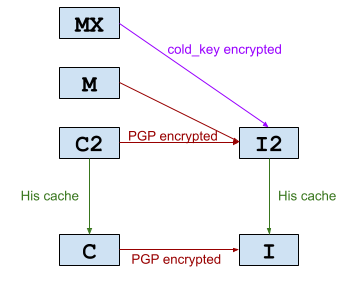

# Unified data policy

## Replication policies

- Level 3H: Level 3 with encrypted history snapshots.

- Level 3: at least 4 copies, in 3 location, 2 countries, 2 continents. 

- Level 2: at least 2 copies. 

- Level 1: at least 1 copies. 

## Confidential Policies

> `sensitive` means I don't want to leak it, `important` means I don't want to lost it. 

- type I2: non-sensitive important data, such as environent setup script, software installation packs, saved movies.

- type I: public personal data, or non-important public data.

- type H: Encrypted history archive (the "H" in replica level 3H)

- type C2: sensitive important personal data, such as photos, game save, server data; 

- type C: sensitive non-important personal data, such as system logs, chat logs, screenshots, web history, development environment.

- type M: secret keys/seeds/passwords, banking account/card information.

- type MX: GPG masterkey itself. 

- [TODO]X

> **super key doesn't not apply any data policy, only allowed to store in-brain.** 

|Type|Encryption|Ownership|Replication|Current\_Solution|
|---|---|---|---|---|
|MX|Always, by Project Hammer             ||          |Project Hammer|
|M |Always, by GPG master key             |1P|Level 3H|nfs/backup/C2_M|
|C2|Deniable encrpytion on trusted device |1P|Level 3H|nfs/backup/C2_M, RecoDrive|
|C |Device-level encryption          |1P / 3P|Level 1|any encrypted devices|
|H |Optional|1P / 3P|Level 2|TODO|
|I2|Optional|1P / 3P|Level 2|nfs/backup/I2, RecoGit, RecoDrive|
|I |Optional|1P / 3P|Level 1|any devices|

|Properties|Important|Non-Important|
|---|---|---|
|Sensitive|MX,M,C2|C|
|Non-sensitive|I2,H|I|

All device storing / processing unencrypted sensitive data, must either using Fully-Open-Source-Software, or be disconnected from Internet and destroyed afterward. 
